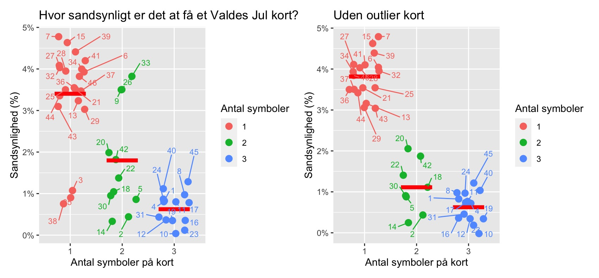
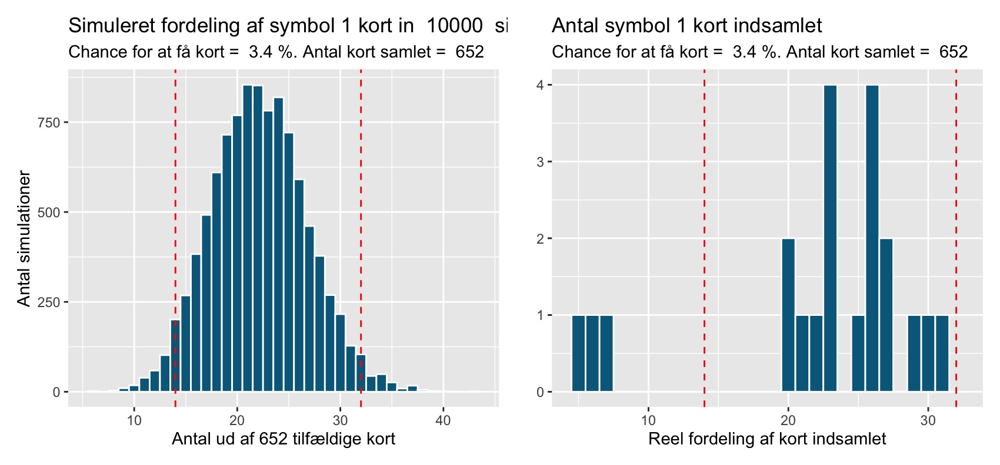

# Kode til analyse af Valde's jul kort

Herunder findes kode til analyse af Valde's jul kort fra julen 2025. Koden kan køres med R.

## Data
Seneste data (op til 10 december 2025) er samlet ind af Benjamin og mig selv (Mike), hovedsagligt i Odense.
Kort-antal er korrigeret for evt. byt, således at data her er opgivet før byt.

## Analyse #1 - sandsynligheden for kort efter antal symboler

Denne analyse bestod af 208 kort indsamlet i og omkring Odense (hovedsagligt fra Bilka i Odense).

*Data*: [kort_7dec.csv](kort_7dec.csv)

*Kode*: [analysis-1.r](analysis-1.r)

*Resultat:*

## Analyse #2 - fund af kort outliers

*Data*: [kort_11dec.csv](kort_11dec.csv)

*Kode*: [analysis-2.r](analysis-2.r)

**Beskrivelse**

Denne analyse består af 652 kort, og identificerer to outlier grupper i kort med 1 eller 2 symboler.

For kort med ét symbol, drejer det sig om: 3, 35, 38.

For kort med to symboler, drejer det sig om: 9, 26, 33.

Hvis man fjerner disse kort er sandsynligheden for at for et kort følgende inden for symbol-kategorierne:

1 symbol: 3,8%

2 symboler: 1,1%

3 symboler: 0,6%

**Resultat:**

Spørgsmålet er om disse outliers kan være opstået tilfældigt (fordi vi kun har indsamlet 652 kort)? Det kan vi undersøge ved en simpel Monte Carlo simulering, hvor vi lader som om vi får 652 kort 10.000 gange... og siger at ét symbol 1 kort er 3,4% sandsynligt at få, og så se hvordan fordeling af disse er.

Til venstre ses vores simulering af 10.000 forskellige samlinger af 652 kort, og hvilken fordeling man ser når der er 3,4% chance for at få et kort.

Vi kan se at i 95% af gange (ud af de 10.000 simuleringer), vil man få et symbol 1 kort (der har 3,4% sandsynlighed) mellem 14 og 32 gange, hvis man samler 652 kort sammen.

For de tre kort der var vores outliers - 3, 35, 38 - har vi fået dem 7, 6 og 5 gange, hvilket er usandsynligt få gange.
